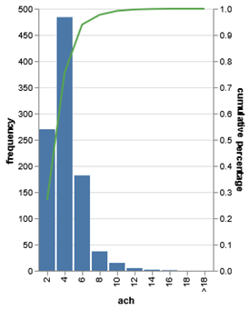

# Overview
**VentiCoolPy** is a Python library developed by Eurac Research to support the development of sustainable cooling strategies for buildings.
This Python library provides the reference implementation of the ventilative cooling potential method developed by the Eurac Research within IEA/EBC Annex 62 and subsequently integrated into the prCEN/TS “Ventilative cooling systems – Design”.
It operationalises the standardised methodology into an open and extensible computational tool for research and professional applications.

The ventilative cooling potential method aims at assessing the cooling potential of ventilative cooling (fx. using natural forces) in a reference thermal and ventilation zone representing the building in its context. 

The ventilative cooling potential method provides a practical approach for application during the early stages of building design, such as the feasibility stage. It enables preliminary evaluation in the absence of detailed system specifications and leverages the adaptive comfort model to account for occupants' ability to adapt to varying indoor conditions, offering a realistic assessment of comfort levels.

## Ventilative cooling potential method
The calculation method to evaluate the ventilative cooling potential is based on a single-zone thermal model applied to user-input climatic data on an hourly basis. The thermal balance calculation method from EN ISO 52016-1:2018 is applied to calculate free-floating temperature and heating and cooling loads (with and without ventilative cooling contribution) of a reference thermal zone of the building. EN ISO 52016-1:2018 has been developed to assess the energy performance of a detailed building design or building in use. For the use in early design phase applications, the detailed hourly thermal balance equations have been reduced to the essential (lumped) parameters, including also lumped thermal capacity.  
The calculation method is fully described in Annex H of prCEN/TS “Ventilative cooling systems – Design”.

## Limitations and intended use
Users of the Ventilative cooling potential method shall be aware of its limitations. Users shall apply the ventilative cooling potential method with consideration for its appropriate scope of application, recognizing that its primary utility lies in early-stage design assessments and that more detailed modelling shall be employed as the design matures and more specific building information become available. 

The ventilative cooling potential method should be considered only as a preliminary analysis on the assumption that the reference room has the characteristics to be represented by such a model where: 

- the air temperature of thermal zone is considered uniform;  

- the heat conduction through the room or zone elements is assumed to be one-dimensional;  

- the solar radiation distribution in the space considered is assumed uniform and time-independent; 

- thermal bridges are calculated in stationary conditions without considering the heat storage contribution; 

- the heat storage effects of glazed surfaces are neglected;  

- solar properties of windows are not solar angle dependent; 

- the total solar energy transmittance is assumed to be direct transmittance into the zone. 

Indoor air temperature and indoor operative temperature are not distinguished. This limitation is acceptable in cases where air velocity is small (<0.2 m/s) or where the difference between mean radiant temperature and air temperature is small (<4 °C). These conditions typically occur in highly insulated buildings with mechanical ventilation systems. Since ventilative cooling implies the use of high airflow rates to cool the environment, the assumption of air velocity smaller than 0.2 m/s might not be true. Therefore, it is important to underline that the evaluation needs to be repeated at later design stages with more detailed calculation methods, i.e. dynamic simulations.  

In practice, the ventilative cooling potential method is best suited for buildings or spaces with straightforward layouts and thermal dynamics that align with the model’s simplified assumptions. These include spaces with uniform air temperatures, such as small residential, commercial, or office buildings. It is particularly applicable to buildings with conventional opaque envelopes, where complex thermal stratification or solar gain patterns are not significant factors.

In these contexts, the use of more comprehensive dynamic simulation tools is strongly recommended. As building design progresses and more detailed information becomes available, transitioning to advanced modeling platforms ensures greater accuracy, more reliable predictions, and the development of an optimized ventilative cooling strategy.
By using this library, users acknowledge that results are indicative and should be validated with detailed simulations before informing final design decisions or implementation strategies.

